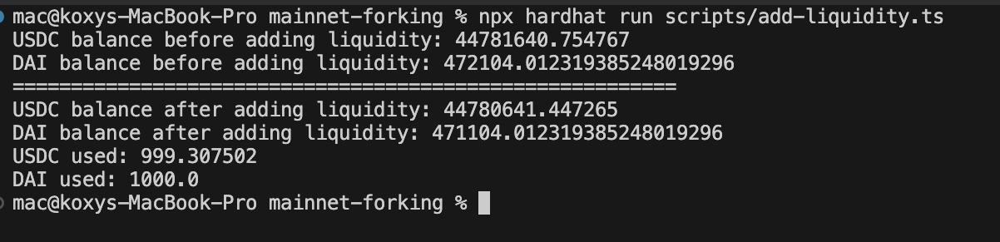
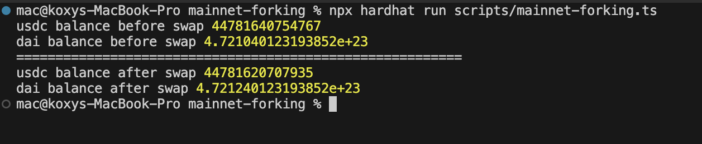

# Uniswap V2 Interaction Project

- This project demonstrates how to interact with the Uniswap V2 protocol using Hardhat and Ethers.js. It includes scripts for swapping tokens and adding liquidity to Uniswap V2 pairs.

